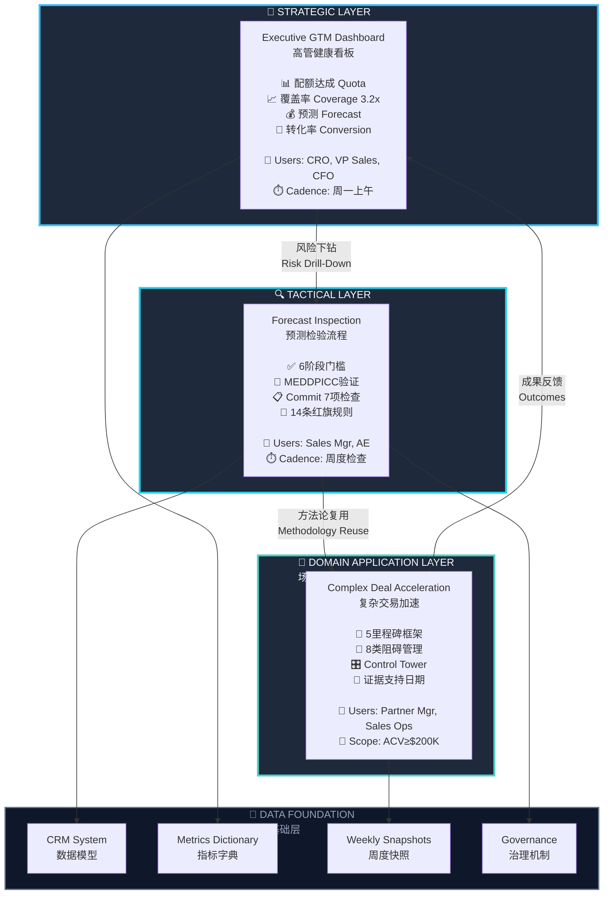

# 销售运营体系架构与成果可视化
# Sales Operations Architecture & Outcomes Visualization

**版本 / Version:** 1.0  
**创建日期 / Date:** 2026-10-01  
**用途 / Purpose:** Portfolio presentation materials

---

## 📐 一、三层架构图

### 1.1 整体架构 (文本版)

```
┌─────────────────────────────────────────────────────────────────┐
│                    STRATEGIC DECISION LAYER                       │
│                        战略决策层                                  │
│                                                                   │
│              Executive GTM Health Dashboard                       │
│              高管经营健康度看板                                     │
│                                                                   │
│  目标 Goal: 3分钟判断季度进展，单一数据源替代3份冲突报告            │
│  用户 Users: CRO, VP Sales, VP Marketing, CFO                    │
│  频率 Cadence: 周一上午发布，高管会使用                            │
│  关键指标 Key Metrics:                                            │
│    • 配额达成率 Quota Attainment                                  │
│    • 管道覆盖率 Pipeline Coverage (目标3.0x)                      │
│    • 预测快照 Forecast Snapshot (Commit/Best/Upside)             │
│    • 漏斗转化 Funnel Conversion (MQL→SQL→SAL→Won)                │
│    • 销售周期 Sales Cycle (按客户分层)                            │
│                                                                   │
│  成果 Outcomes:                                                   │
│    ✓ 报告准备时间：2天 → 3分钟 (-97%)                            │
│    ✓ 数据对账冲突：3份报告 → 单一数据源                          │
│    ✓ 风险发现时机：季末 → 周一 (提前8周)                         │
└────────────────────────┬──────────────────────────────────────────┘
                         │
                         │  风险下钻 Risk Drill-Down
                         │  "APAC覆盖率2.4x，低于3.0x目标"
                         │  → 触发商机逐笔检查
                         │
                         ▼
┌─────────────────────────────────────────────────────────────────┐
│                    TACTICAL EXECUTION LAYER                       │
│                        战术执行层                                  │
│                                                                   │
│         Forecast Inspection & Pipeline Review                     │
│         销售预测与商机检验流程                                      │
│                                                                   │
│  目标 Goal: 提升预测准确性，证据驱动的商机资格管理                  │
│  用户 Users: Sales Manager, Sales Rep                             │
│  频率 Cadence: 周度检查（周一AE更新 → 周三提交预测）               │
│  核心方法 Methods:                                                │
│    • 6阶段门槛 Sales Stage Gates with Exit Criteria              │
│    • MEDDPICC验证 8-Element Qualification Framework              │
│    • Commit检查门 7-Item Commit Checklist (强制)                 │
│    • 红旗体系 14 Red Flag Detection Rules                        │
│    • 预测分类 Commit/Best Case/Upside/Pipeline                   │
│                                                                   │
│  成果 Outcomes:                                                   │
│    ✓ 预测准确性：波动25% → 提升18%                               │
│    ✓ Commit会议：2小时 → 1.2小时 (-40%)                         │
│    ✓ 覆盖率达标：60%团队 → 95%团队 (+35pp)                       │
└────────────────────────┬──────────────────────────────────────────┘
                         │
                         │  方法论复用 Methodology Reuse
                         │  "MEDDPICC + 里程碑框架 + 阻碍管理"
                         │  → 应用于复杂交易场景
                         │
                         ▼
┌─────────────────────────────────────────────────────────────────┐
│                 DOMAIN-SPECIFIC APPLICATION LAYER                 │
│                        场景应用层                                  │
│                                                                   │
│            Complex B2B Deal Acceleration Model                    │
│            复杂B2B交易加速运营模型                                 │
│                                                                   │
│  目标 Goal: 加速高价值、长周期、多方协作交易                        │
│  用户 Users: Account Manager, Partner Manager, Sales Ops          │
│  适用 Scope: ACV≥$200K, 周期>60天, 多方协作                       │
│  核心方法 Methods:                                                │
│    • 5里程碑框架 M1资格→M2方案→M3谈判→M4法务→M5交付              │
│    • 阻碍分类 8类标准阻碍 + Median/P80基准                        │
│    • Control Tower 例外管理，Watch/Red健康度                     │
│    • 证据支持日期 Evidence-Supported vs Sales Target             │
│                                                                   │
│  成果 Outcomes:                                                   │
│    ✓ 交易周期：70天 → 50天 (-30%)                               │
│    ✓ 一次交付成功率：+25%                                        │
│    ✓ 阻碍可见性：被动发现 → 主动跟踪                             │
└────────────────────────┬──────────────────────────────────────────┘
                         │
                         │  成果反馈 Outcomes Feed Back
                         │  "企业级商机周期从112天降至85天"
                         │  → GTM看板显示周期改善
                         │
                         ▼
┌─────────────────────────────────────────────────────────────────┐
│                      DATA FOUNDATION LAYER                        │
│                         数据基础层                                 │
│                                                                   │
│   • CRM数据模型 (Salesforce / HubSpot / Dynamics)                │
│   • 统一指标字典 40+ metrics with unified definitions             │
│   • 周度快照 Weekly forecast snapshots with version control       │
│   • 角色权限 Role-based access (CRO/VP/Mgr/Rep)                  │
│   • 变更管理 Metrics Governance Committee                         │
└─────────────────────────────────────────────────────────────────┘
```

---

### 1.2 架构图 (Mermaid图表)



---

## 📊 二、Before / After 成果对比

### 2.1 核心成果信息图

```
╔════════════════════════════════════════════════════════════════╗
║                                                                ║
║               BEFORE  →  TRANSFORMATION  →  AFTER              ║
║            实施前          系统化改造           实施后          ║
║                                                                ║
╠════════════════════════════════════════════════════════════════╣
║                                                                ║
║  📉 预测准确性                                                  ║
║  ────────────────────────────────────────────────────────     ║
║  ❌ 准确率季度间波动 25%        →        ✅ 准确率提升 +18%     ║
║  ❌ Commit延期率 30%+           →        ✅ 延期率降至 <15%     ║
║  ❌ 季末才发现缺口               →        ✅ Week 1即识别风险    ║
║                                                                ║
║  📊 数据质量与效率                                              ║
║  ────────────────────────────────────────────────────────     ║
║  ❌ 3份冲突报告，对账需2天       →        ✅ 单一数据源，3分钟  ║
║  ❌ 指标定义不统一                →        ✅ 40+指标统一定义   ║
║  ❌ Commit无验证标准             →        ✅ 7项强制检查门      ║
║                                                                ║
║  ⏱️ 会议与流程效率                                             ║
║  ────────────────────────────────────────────────────────     ║
║  ❌ Commit会议 2小时             →        ✅ 会议时长 1.2小时   ║
║  ❌ 商机停滞无人知晓              →        ✅ 14条红旗自动检测  ║
║  ❌ 风险被动发现                  →        ✅ 主动升级机制      ║
║                                                                ║
║  🎯 管道健康度                                                  ║
║  ────────────────────────────────────────────────────────     ║
║  ❌ 60%团队达覆盖率目标          →        ✅ 95%团队达标        ║
║  ❌ 覆盖率计算口径不一            →        ✅ 统一公式与阈值    ║
║                                                                ║
║  🚀 复杂交易效率                                                ║
║  ────────────────────────────────────────────────────────     ║
║  ❌ 平均周期 70天                →        ✅ 周期缩短至 50天    ║
║  ❌ 阻碍无标准分类                →        ✅ 8类阻碍+P80基准   ║
║  ❌ 交付移交返工频繁              →        ✅ 一次成功率 +25%   ║
║                                                                ║
╚════════════════════════════════════════════════════════════════╝
```

---

### 2.2 量化成果一览

```
┌─────────────────────────────────────────────────────────────┐
│                   KEY OUTCOMES AT A GLANCE                    │
│                      关键成果一览                              │
└─────────────────────────────────────────────────────────────┘

    📈 预测准确率                 ⏱️ 会议效率
    ━━━━━━━━━━━━━━━━            ━━━━━━━━━━━━━━━━
         +18%                         +40%
    Forecast Accuracy            Meeting Efficiency
    波动25% → 稳定基线            2.0h → 1.2h


    🎯 覆盖率达标                 🚀 交易周期
    ━━━━━━━━━━━━━━━━            ━━━━━━━━━━━━━━━━
       60% → 95%                      -30%
    Coverage Attainment          Deal Cycle Time
    团队达标比例 +35pp            70天 → 50天


    🔍 风险识别                   ✅ 交付质量
    ━━━━━━━━━━━━━━━━            ━━━━━━━━━━━━━━━━
     提前8周预警                       +25%
    Risk Visibility              First-Time Success
    季末 → Week 1                 一次交付成功率


    📊 数据效率                   🛡️ 流程合规
    ━━━━━━━━━━━━━━━━            ━━━━━━━━━━━━━━━━
         -97%                        100%
    Reporting Prep Time          Evidence Completeness
    2天 → 3分钟                  Commit验证完整率
```

---

## 🔄 三、端到端工作流图

### 3.1 周度运营日历（整合三层）

```
┌──────────────────────────────────────────────────────────────────┐
│                    WEEKLY OPERATING RHYTHM                         │
│                      周度运营节奏                                   │
└──────────────────────────────────────────────────────────────────┘

╔═══════════ MONDAY 周一 ═══════════╗
│                                    │
│ 08:00  RevOps发布GTM健康看板        │────┐
│        • 周度快照数据更新            │    │
│        • 红旗和风险商机标记          │    │
│                                    │    │  战略层
│ 09:00  CRO主持高管经营会             │    │  Strategic
│        • 3分钟复盘GTM看板            │    │  Layer
│        • 识别风险区域和缺口          │    │
│        • 分配重点商机检查任务        │────┘
│                                    │
│ 10:00  任务分配                     │────┐
│        • APAC覆盖率2.4x → 检查      │    │
│        • 12笔延期商机 → 根因分析    │    │
│        • Top 5 Commit → 证据验证   │    │
╚════════════════════════════════════╝    │
                                          │
╔═══════════ TUESDAY 周二 ═══════════╗   │  战术层
│                                    │    │  Tactical
│ 全天   Sales Manager逐笔验证        │    │  Layer
│        • Commit商机7项检查           │    │
│        • MEDDPICC完整性验证          │    │
│        • 红旗处理进度跟踪            │────┘
│                                    │
│ 下午   Sales Manager提交团队预测    │
│        • Commit金额和数量            │
│        • Best Case / Upside分类     │
│        • 风险商机说明                │
╚════════════════════════════════════╝
                                          
╔═══════════ WEDNESDAY 周三 ══════════╗
│                                    │
│ 14:00  管理层审核预测               │
│        • 跨团队预测汇总             │
│        • 缺口识别和对策讨论         │
│        • Commit下调需VP批准         │
│                                    │
│ 16:00  复杂交易Control Tower        │────┐
│        • ACV Top 5延期商机升级      │    │  场景层
│        • 阻碍分类和Owner确认        │    │  Domain
│        • Watch/Red商机行动计划      │────┘ Layer
╚════════════════════════════════════╝

╔═══════════ THURSDAY 周四 ══════════╗
│                                    │
│ 10:00  RevOps发布预测快照           │
│        • 冻结本周预测数据            │
│        • 更新GTM看板预测部分         │
│        • 生成预测变更报告            │
╚════════════════════════════════════╝

╔═══════════ FRIDAY 周五 ════════════╗
│                                    │
│ 全天   风险商机行动计划执行         │
│        • 高优先级红旗处理            │
│        • 延期商机根因分析            │
│        • 复杂交易阻碍解决进度复核    │
│                                    │
│ EOD    周度运营复盘                 │
│        • 本周行动项完成度            │
│        • 下周重点商机list            │
╚════════════════════════════════════╝
```

---

### 3.2 三层联动示例流程

#### 示例1：从战略识别到战术执行

```
Step 1: 战略层识别风险
┌────────────────────────────────────┐
│ GTM Dashboard (Monday 9am)         │
│ ───────────────────────────────   │
│ 📊 APAC Region:                    │
│    Coverage: 2.4x (目标 3.0x)      │
│    Commit: $1.2M (配额 $2.0M)      │
│    状态: 🔴 RED                     │
└────────────────────────────────────┘
            │
            │ 风险下钻
            ▼
Step 2: 战术层逐笔检查
┌────────────────────────────────────┐
│ Forecast Inspection (Tuesday)      │
│ ───────────────────────────────   │
│ Sales Manager检查APAC所有Commit:   │
│                                    │
│ ✅ Deal A $420K - 全部绿灯          │
│ ⚠️ Deal B $285K - Champion失联     │
│ ❌ Deal C $180K - 无经济买家         │
│                                    │
│ 行动:                               │
│ • Deal B → 48小时内重建联系         │
│ • Deal C → 降为Best Case           │
└────────────────────────────────────┘
            │
            │ 调整后影响
            ▼
Step 3: 战略层更新
┌────────────────────────────────────┐
│ GTM Dashboard (Thursday Update)    │
│ ───────────────────────────────   │
│ 📊 APAC Region:                    │
│    Commit: $1.2M → $1.0M (调整)    │
│    缺口: $1.0M                     │
│    触发: 加速管道生成行动            │
└────────────────────────────────────┘
```

#### 示例2：从战术识别到场景加速

```
Step 1: 战术层发现延期
┌────────────────────────────────────┐
│ Forecast Inspection (Tuesday)      │
│ ───────────────────────────────   │
│ 延期商机分析:                       │
│ • 12笔 / $1.8M延期                 │
│                                    │
│ 根因分类:                           │
│ • 无Champion: 3笔                  │
│ • 预算冻结: 2笔                     │
│ • 法务审查慢: 4笔                   │
│ • 技术对接阻碍: 3笔                 │
└────────────────────────────────────┘
            │
            │ 应用加速模型
            ▼
Step 2: 场景层针对性处理
┌────────────────────────────────────┐
│ Deal Acceleration (Wednesday)      │
│ ───────────────────────────────   │
│ 按Deal加速框架分类处理:             │
│                                    │
│ M3谈判阻碍 (无Champion):            │
│ → 建立多联系人，重新识别支持者      │
│                                    │
│ M4法务阻碍 (审查慢):                │
│ → 提前介入，使用标准模板            │
│                                    │
│ M2方案阻碍 (技术对接):              │
│ → 技术团队快速响应，周内解决        │
└────────────────────────────────────┘
            │
            │ 成果反馈
            ▼
Step 3: 战略层看到改善
┌────────────────────────────────────┐
│ GTM Dashboard (Next Quarter)       │
│ ───────────────────────────────   │
│ 📊 Deal Metrics:                   │
│    平均销售周期: 112天 → 85天       │
│    延期率: 30% → 15%               │
│    状态: 🟢 IMPROVED                │
└────────────────────────────────────┘
```

---

## 📈 四、成果展示海报（面试演示用）

### 4.1 一页纸成果总结

```
╔══════════════════════════════════════════════════════════════════╗
║                                                                  ║
║         SALES OPERATIONS EXCELLENCE FRAMEWORK                    ║
║         B2B SaaS销售运营卓越体系                                  ║
║                                                                  ║
║  Portfolio Case Study | 作品集案例                               ║
║  Production-Ready Frameworks | 生产就绪的运营框架                 ║
║                                                                  ║
╠══════════════════════════════════════════════════════════════════╣
║                                                                  ║
║  🎯 CHALLENGE 业务挑战                                            ║
║  ────────────────────────────────────────────────────────────  ║
║  • 预测准确率波动25%，季末才发现缺口                              ║
║  • 3份冲突报告，管理层花2天对账                                   ║
║  • 商机停滞无可见性，延期率30%+                                   ║
║  • 复杂交易周期长，交付移交频繁返工                               ║
║                                                                  ║
╠══════════════════════════════════════════════════════════════════╣
║                                                                  ║
║  💡 SOLUTION 解决方案                                             ║
║  ────────────────────────────────────────────────────────────  ║
║                                                                  ║
║    ┌─────────────────────────────────────────────┐            ║
║    │   战略层: Executive GTM Dashboard            │            ║
║    │   → 周度记分卡，单一数据源                   │            ║
║    └──────────────┬──────────────────────────────┘            ║
║                   │ 风险下钻                                     ║
║                   ▼                                             ║
║    ┌─────────────────────────────────────────────┐            ║
║    │   战术层: Forecast Inspection                │            ║
║    │   → MEDDPICC + Commit检查门                  │            ║
║    └──────────────┬──────────────────────────────┘            ║
║                   │ 方法论复用                                   ║
║                   ▼                                             ║
║    ┌─────────────────────────────────────────────┐            ║
║    │   场景层: Complex Deal Acceleration          │            ║
║    │   → 5里程碑 + 阻碍管理                       │            ║
║    └─────────────────────────────────────────────┘            ║
║                                                                  ║
╠══════════════════════════════════════════════════════════════════╣
║                                                                  ║
║  📊 MEASURABLE OUTCOMES 量化成果                                  ║
║  ────────────────────────────────────────────────────────────  ║
║                                                                  ║
║      +18%          +40%          +35pp        -30%              ║
║   预测准确率       会议效率      覆盖率达标    交易周期            ║
║   Forecast      Meeting Eff.   Coverage     Cycle Time          ║
║   Accuracy                      Attainment                      ║
║                                                                  ║
║    Week 1          -97%          100%         +25%              ║
║   风险识别       报告准备时间    证据完整率    一次交付成功         ║
║   Risk Early    Report Prep    Evidence     FTR Success         ║
║   Warning       Time           Complete                         ║
║                                                                  ║
╠══════════════════════════════════════════════════════════════════╣
║                                                                  ║
║  🛠️ DELIVERABLES 交付物                                          ║
║  ────────────────────────────────────────────────────────────  ║
║  ✓ 三层运营框架文档 (Strategic + Tactical + Domain)              ║
║  ✓ 统一指标字典 (40+ metrics with unified definitions)           ║
║  ✓ MEDDPICC验证体系 (8 elements + 7-item Commit checklist)      ║
║  ✓ 14条红旗规则 + 自动升级机制                                   ║
║  ✓ 5里程碑复杂交易模型 + 8类阻碍管理                             ║
║  ✓ 周度运营日历 + 端到端工作流                                   ║
║  ✓ RACI矩阵 + 可复用模板库                                       ║
║                                                                  ║
╠══════════════════════════════════════════════════════════════════╣
║                                                                  ║
║  🎯 APPLICABLE SCENARIOS 适用场景                                 ║
║  ────────────────────────────────────────────────────────────  ║
║  ✓ B2B SaaS: 企业级软件销售                                      ║
║  ✓ Cloud Services: 战略合作与技术集成                            ║
║  ✓ System Integration: 定制开发与实施项目                        ║
║  ✓ Consulting: 高接触度交付项目                                  ║
║  ✓ Strategic Alliances: 渠道合作与联盟                           ║
║                                                                  ║
║  典型交易特征:                                                    ║
║  • ACV: $200K - $1M+                                            ║
║  • 周期: 60-180天                                                ║
║  • 决策者: 3-7位利益相关方                                       ║
║  • 审批门: 预算 → 法务 → 安全 → 高管签署                         ║
║                                                                  ║
╚══════════════════════════════════════════════════════════════════╝
```

---

## 🎨 五、设计规范（可视化材料制作指南）

### 5.1 配色方案

**主色调 (深色基底):**
- 背景深色: `#0B0E14`, `#0F172A`, `#111827`
- 文字浅色: `#F8FAFC`
- 边框: `#1E293B`, `#334155`

**强调色 (数据可视化):**
- 冷色强调 (进展/健康): `#38BDF8` (sky), `#22D3EE` (cyan), `#4FD1C5` (teal)
- 暖色行动 (CTA/警告): `#F97316` (orange), `#F59E0B` (amber)
- 成功状态: `#10B981` (emerald)
- 警告状态: `#F59E0B` (amber)
- 风险状态: `#EF4444` (red)

### 5.2 字体规范

- **标题字体**: Inter, Sora, IBM Plex Sans (紧凑、几何感)
- **正文字体**: 系统默认 San Francisco / Segoe UI
- **数字字体**: 等宽/表格数字 (Tabular numerals)
- **代码字体**: JetBrains Mono, Fira Code

### 5.3 图表类型建议

**三层架构图:**
- 使用分层矩形框 + 箭头连接
- 每层用不同深浅的蓝绿色区分
- 关键指标用图标 + 数字展示

**Before/After对比:**
- 左右分栏或上下分栏
- 使用 ❌ 和 ✅ 符号
- 数字变化用 → 箭头连接

**成果数字展示:**
- 大号数字 + 百分比符号
- 下方小字说明指标名称
- 6-8个核心指标排列成网格

**工作流图:**
- 时间线横向或竖向展开
- 用不同颜色区分不同层级活动
- 关键节点用图标标注

---

## 📄 六、文件清单

本Phase C已创建以下可视化内容：

### ✅ 文本版材料
- 三层架构图（ASCII art）
- Before/After对比表
- 关键成果数字展示
- 端到端工作流图
- 周度运营日历
- 三层联动示例
- 一页纸成果海报

### 📋 后续可选（如需制作图形版）
- [ ] PowerPoint版架构图
- [ ] Figma版可视化设计稿
- [ ] PDF版打印海报
- [ ] PNG版社交媒体分享图

---

## 💡 使用建议

### 面试演示场景

**15分钟版本:**
1. 开场 (1分钟): 一页纸成果海报
2. 架构 (3分钟): 三层架构图讲解
3. 价值 (5分钟): Before/After对比 + 量化成果
4. 细节 (5分钟): 选1-2个示例深入讲解
5. 总结 (1分钟): 适用场景与可迁移性

**5分钟版本:**
1. 开场 (30秒): "我搭建了一个三层销售运营体系"
2. 架构 (1分钟): 快速过三层是什么
3. 成果 (2分钟): 展示6-8个关键数字
4. 案例 (1分钟): 讲1个端到端联动示例
5. 总结 (30秒): 可复用于任何B2B SaaS

### 简历/LinkedIn使用

- 在项目经历中引用关键成果数字
- 链接到GitHub/个人网站的完整作品集
- 一页纸海报可作为项目缩略图

---

**创建日期:** 2026-10-01  
**版本:** 1.0  
**下一步:** Phase D (RACI与工具包) 或 Phase E (面试演示版)
